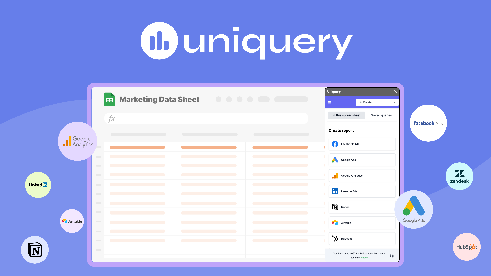
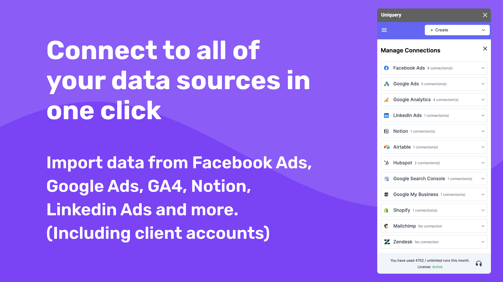
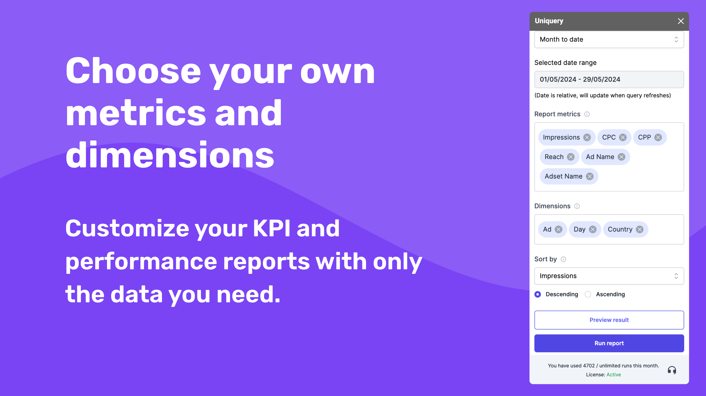
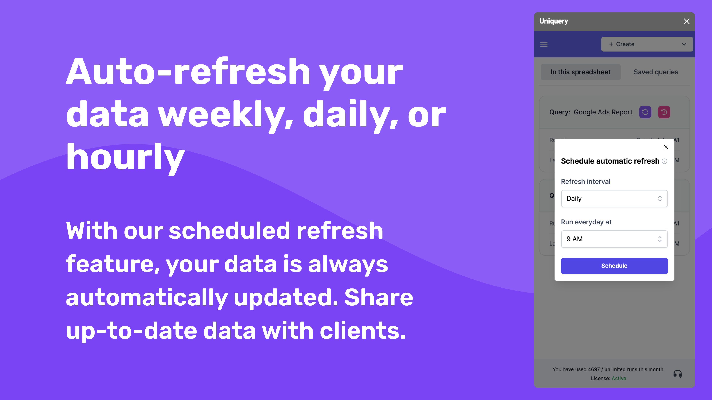

# Home

Welcome to the official Uniquery Help Center. [Uniquery](https://uniquery.io/) is designed with one goal in mind: to simplify data workflows for individuals and teams by connecting APIs directly to your Google Sheets.&#x20;

<figure><figcaption></figcaption></figure>

With the power of Uniquery, you can:

* Automate data imports and eliminate tedious manual exports.
* Effortlessly connect and sync your data across over 100 sources, including marketing platforms, analytics tools, and more.
* Automatically update your imported data in the cloud.
* Strengthen data workflows with customizable and scalable API connections.

This Help Center is your comprehensive guide to getting the most out of Uniquery. Below is an overview of what we cover:

#### 1. Getting Started with Uniquery 

* Introduction to Uniquery: What it is and who it's for.
* Installation and setup in Google Sheets™.
* Navigating the Uniquery menu and user interface.

#### **2. Core Features & Functionalities** 

* Complete guide to the API Connector.
* Using HTTP methods for API requests: GET, POST, PUT, PATCH, and DELETE.
* Fetching and importing data in JSON and CSV formats.
* Scheduling automatic data refreshes (hourly, daily, weekly).

#### **3. Security & OAuth Integrations** 

* Overview of OAuth 2.0 and secure API connections.
* Setting up OAuth configurations for platforms like Facebook Ads, Google Analytics, and more.
* Sharing API connections with your team securely.

#### **4. Advanced Guides & Tips** 

* Using cell references for dynamic API query customization.
* Managing headers, body fields, and authentication for tailored API setups.
* Connecting Uniquery to Google Looker Studio for advanced visualization.

#### **5. Common Use Cases** 

* How marketing agencies use Uniquery to streamline campaign reporting.
* Generating comprehensive dashboards with real-time data refresh.
* Enhancing workflow collaboration within teams.

#### **6. Troubleshooting & FAQs** 

* Resolving common issues with API integrations.
* Understanding error codes and debugging queries.
* General product FAQs to ensure a smooth experience.

### An overview of Uniquery features

#### Connect to your data sources

Uniquery simplifies the data import process for marketers and marketing agencies by allowing you to connect to all your data sources with just one click. Whether you're managing campaigns on Facebook Ads, Google Ads, LinkedIn Ads, or analyzing metrics from Google Analytics and Google Search Console, Uniquery has you covered. It also supports integrations with essential tools like HubSpot, Mailchimp, Shopify, Zendesk, and Stripe. For agencies handling multiple client accounts, Uniquery makes it easy to import and manage data from each client's platforms, ensuring you have a comprehensive view of all your marketing efforts in one place.

<figure><figcaption></figcaption></figure>

#### Select your metrics and dimensions

Uniquery empowers you to create highly customized KPI and performance reports by allowing you to select only the metrics and dimensions that matter most to your campaigns. With more than 1000 metrics and dimensions from various data sources, you can build the most relevant and accurate marketing reports tailored to your needs. Additionally, you have the flexibility to choose the date range for your reports, ensuring that your data analysis is always timely and contextually appropriate. This level of customization helps you deliver actionable insights to your clients, enhancing your reporting and decision-making processes.

<figure><figcaption></figcaption></figure>

#### Automatic data refresh

Stay on top of your campaigns with Uniquery's scheduled refresh feature, which automatically updates your data on a weekly, daily, or even hourly basis. This ensures that you always have the most current information at your fingertips, allowing you to make timely and informed decisions. For marketing agencies, this means you can effortlessly share up-to-date data with clients, providing them with real-time insights and enhancing your reporting accuracy. No more manual updates or outdated reports—Uniquery keeps your data fresh and reliable, so you can focus on optimizing your marketing strategies.&#x20;

<figure><figcaption></figcaption></figure>

#### OAuth 2.0 support and pagination handling&#x20;

Uniquery's OAuth 2.0 support ensures that you can connect to any API endpoint seamlessly, a crucial feature for marketers who need to access diverse and secure data sources. Additionally, Uniquery automatically handles pagination, allowing you to import large datasets effortlessly. This means you can focus on analyzing and optimizing your marketing strategies while Uniquery manages the technical complexities, ensuring you have all the data you need at your fingertips.

We’re excited to help you explore Uniquery’s full potential! Browse through the topics above to dive into a particular feature or check out our guides for hands-on assistance.

Get started now and take control of your data with **Uniquery**!
