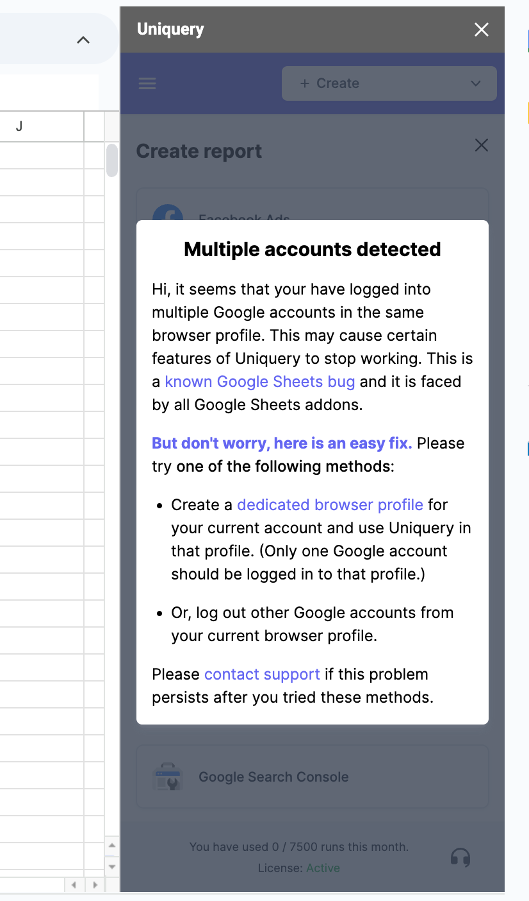

# Multiple account issues

### 1. What if I see the "Multiple accounts detected" page?

<figure><figcaption></figcaption></figure>

If you encounter the "Multiple accounts detected" page while using Uniquery, it is likely that you are logged into multiple Google accounts within the same browser profile. This situation can cause certain features of Uniquery to stop functioning correctly, as it is [a known issue with Google Sheets](https://developers.google.com/apps-script/guides/projects#fix-issues) and affects all Google Sheets add-ons.

**Here’s what is happening:** When you are logged into multiple Google accounts within a single browser profile, Google Sheets can get confused about which account to use for the add-on, leading to inconsistent or non-functional behavior. This is due to the way Google handles authentication and session management across its services.

**To resolve this problem, you can try one of the following methods:**

First, consider creating a dedicated browser profile for your current Google account and use Uniquery exclusively within that profile. By ensuring that only one Google account is logged into that dedicated profile, you can avoid conflicts and ensure the smooth operation of Uniquery.

To create a new browser profile, follow these steps to ensure that Uniquery operates smoothly without any conflicts from multiple logged-in Google accounts:\

1. **Open Your Browser**: Launch the web browser where you use Uniquery, such as Google Chrome.\

2. **Access Profile Settings**: In the upper-right corner of the browser window, you will see your current profile icon (usually an avatar or the first letter of your name). Click on this icon to open the profile menu.\

3. **Manage Profiles**: In the profile menu, look for the option that says "Manage profiles" or "Add another account." Click on this option to proceed.\

4. **Create a New Profile**: You will be directed to a screen where you can manage existing profiles or create a new one. Click on the "Add" button to create a new profile.\

5. **Set Up Your New Profile**: You will be prompted to choose a name and an avatar for your new profile. Fill in these details and click "Add." This will create a new browser profile.\

6. **Log Into Your Google Account**: Once the new profile is created, a new browser window will open with the new profile. In this window, navigate to Google and log into the Google account you wish to use with Uniquery. Ensure that no other Google accounts are logged in within this profile.

Alternatively, you can log out of any other Google accounts from your current browser profile. This will help eliminate any confusion caused by multiple active sessions and allow Uniquery to properly authenticate with your intended Google account.

If you continue to experience issues after trying these methods, please do not hesitate to contact our support team for further assistance. We are here to help and will work with you to ensure that you can use Uniquery without any interruptions.

### 2. When I try to connect to another Google account in account connection, I see a 401 error or "too many redirects" error.

This issue arises when you are logged into one Google account (your primary account) but attempt to connect to a Google service (such as Google Ads or Google Analytics) that belongs to a different Google account. As a result, you may encounter a 401 error or a "This page redirected you too many times" error.

To illustrate, imagine you are using Uniquery through the Google account [abc@gmail.com](mailto:abc@gmail.com), but you want to connect to the Google Ads account of [xyz@gmail.com](mailto:xyz@gmail.com). You are likely to experience this error because Google Chrome is unable to distinguish which user is making the request, leading to authentication conflicts. This problem shares the same root cause as the "multiple user account" issue, where Google's session management becomes confused.

To resolve this problem, follow these steps:\

1. **Create a Separate Chrome Profile:** Open a standalone Chrome profile dedicated to the Google account [xyz@gmail.com](mailto:xyz@gmail.com). Ensure that only [xyz@gmail.com](mailto:xyz@gmail.com) is logged into this new profile.
2. **Connect Uniquery with the Desired Account:** Use the Manage Connections feature in Uniquery to connect with the Google Ads account of [xyz@gmail.com](mailto:xyz@gmail.com). Once you have established the connection, click on "export connection." This action will copy a connection string to your clipboard.
3. **Switch Back to Your Primary Profile:** Open the standalone Chrome profile for your primary account [abc@gmail.com](mailto:abc@gmail.com), ensuring that only [abc@gmail.com](mailto:abc@gmail.com) is logged into this profile.
4. **Import the Connection:** Go to the Manage Connections feature in Uniquery and import the connection string that you copied earlier. This will allow you to use the Google Ads connection belonging to [xyz@gmail.com](mailto:xyz@gmail.com) from within your primary account.

By following these steps, you can successfully manage and use connections across different Google accounts without encountering errors. If you need further assistance, please feel free to contact our support team. We are here to help you make the most of Uniquery, your trusted marketing data platform.
